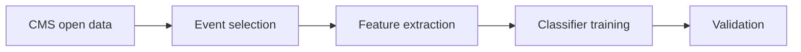

I am Safiye K. Eker, an undergraduate physics student at the Department of Physics, Mimar Sinan Fine Arts University in Istanbul, Türkiye. I am in my third year.

Research interests
======
- High energy and particle physics
- The early universe
- Machine learning
- Topology

- 
Current research
======
I am the principal investigator of a research project supported by the TÜBİTAK 2209-A Research Project Support Programme for Undergraduate Students. The project uses machine learning to analyze open data from the CMS experiment at the Large Hadron Collider (LHC). My advisor is Assistant Professor Nilay Bostan, Department of Physics, Marmara University.

I study the theory behind the analysis and apply it step by step. This includes the physics of proton–proton collisions and the statistical and machine learning methods used to separate signal from background. In practice, I select events, build kinematic features, and train classifiers such as boosted decision trees and neural networks. I use Python, ROOT, and C++.

I keep the whole research process in a public [GitHub repository](https://github.com/Trace-Zero/2209-A). It includes my code and my notes on the theory that I have learned.

Analysis workflow
======
The workflow of my analysis has five main steps.



Evaluation metrics
======
I judge the classifiers with the area under the ROC curve (AUC) and with a significance measure. For a signal yield \\(s\\) and a background yield \\(b\\), the approximate discovery significance is

$$
Z = \sqrt{2\left[(s+b)\ln\left(1+\frac{s}{b}\right) - s\right]}
$$

The plot below shows this formula for a fixed background of \\(b = 100\\) events. It is only an illustration of the formula. It is not a result of my analysis.

```plotly
{
  "data": [
    {
      "x": [0, 5, 10, 15, 20, 25, 30, 35, 40, 45, 50],
      "y": [0.0, 0.496, 0.984, 1.465, 1.938, 2.405, 2.866, 3.321, 3.77, 4.213, 4.652],
      "type": "scatter",
      "mode": "lines+markers",
      "name": "Z"
    }
  ],
  "layout": {
    "xaxis": { "title": { "text": "Signal yield s (events)" } },
    "yaxis": { "title": { "text": "Significance Z" } }
  }
}
```

Experience
======
- **Undergraduate research intern**, Nuclear Detectors and Robotics Application and Research Center (İZÜNAR), Istanbul Sabahattin Zaim University (July – November 2025). I worked on Geant4 simulations and ROOT data analysis to model detector responses.
- **Team captain**, Beamline for Schools competition, CERN (2022 – 2023). Our team proposed an experiment on Michel electrons from muon decay, and the proposal won the Outreach Proposal Award. I presented this work as a poster at the Turkish Physical Society Congress.

For those users that need more advanced functionality, the template also supports the following popular tools:
- [MathJax](https://www.mathjax.org/) for mathematical equations
- [Mermaid](https://mermaid.js.org/) for diagraming
- [Plotly](https://plotly.com/javascript/) for plotting

