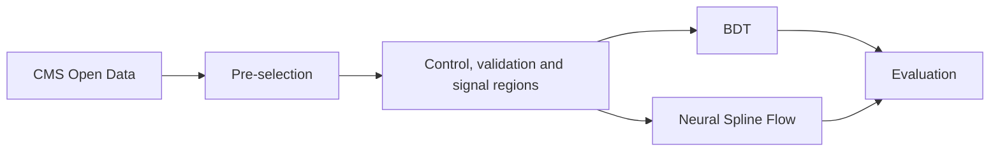

I am Safiye K. Eker, an undergraduate physics student at the Department of Physics, Mimar Sinan Fine Arts University in Istanbul, Türkiye. I am in my third year.

Research interests
======
- High energy and particle physics
- The early universe
- Machine learning
- Topology

- 
Current research
======
Current research
======
I am the principal investigator of a research project supported by the TÜBİTAK 2209-A Research Project Support Programme for Undergraduate Students. The project searches for dark matter in the mono-Z channel using CMS Open Data. In this channel, a Z boson decays to two charged leptons (electrons or muons) and the event has large missing transverse energy. This missing energy could come from dark matter particles that do not interact with the detector. My advisor is Assistant Professor Nilay Bostan, Department of Physics, Marmara University.

I compare two ways to separate signal from the Standard Model background:

- **Supervised learning.** A boosted decision tree (BDT) is trained to tell background from signal.
- **Density estimation.** A Neural Spline Flow (NSF) learns the probability density of the background only. Events that the model finds unlikely are treated as signal candidates.

The background is a cross-section weighted mixture of Drell–Yan, ZZ, WZ, t̄t, and tW simulations. The signal is a simulated dark matter process, q q̄ → Z χ χ̄. I keep the theoretical background of the project in a public [GitHub repository](https://github.com/Trace-Zero/2209-A).

Analysis workflow
======

I select events with two leptons of the same flavor and opposite charge, a dilepton mass between 60 and 120 GeV, and a leading lepton transverse momentum above 25 GeV. I train the models in a low-MET control region and check them in a separate validation region, before looking at the signal region.

Evaluation
======
For the density model, the anomaly score of an event x is the negative log-likelihood,

$$
\mathrm{NLL}(x) = -\log p_\theta(x)
$$

I also use a likelihood-ratio score with two flows, one trained on the background (SM) and one on the signal (DM),

$$
S(x) = \mathrm{NLL}_{\mathrm{SM}}(x) - \mathrm{NLL}_{\mathrm{DM}}(x)
$$

I judge the models with the area under the ROC curve (AUC), the Kolmogorov–Smirnov test, and an approximate discovery significance.

Experience
======
- **Undergraduate research intern**, Nuclear Detectors and Robotics Application and Research Center (İZÜNAR), Istanbul Sabahattin Zaim University (July – November 2025). I worked on Geant4 simulations and ROOT data analysis to model detector responses.
- **Team captain**, Beamline for Schools competition, CERN (2022 – 2023). Our team proposed an experiment on Michel electrons from muon decay, and the proposal won the Outreach Proposal Award. I presented this work as a poster at the Turkish Physical Society Congress.

For those users that need more advanced functionality, the template also supports the following popular tools:
- [MathJax](https://www.mathjax.org/) for mathematical equations
- [Mermaid](https://mermaid.js.org/) for diagraming
- [Plotly](https://plotly.com/javascript/) for plotting

